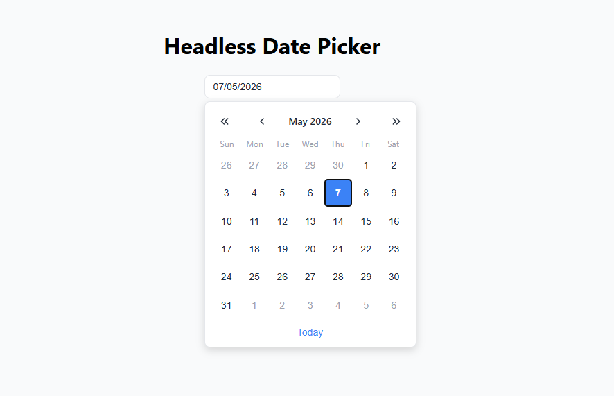

# Headless Date Picker

A small Vue 3 + Vite date picker built with separated date engine logic, composables, reusable date utilities, SVG navigation icons, and basic accessibility support.

Live preview: https://hog099.github.io/headless-datepicker-vue/



## Approach

The calendar logic lives in a standalone TypeScript engine with no Vue imports. Vue uses a composable to create the engine, mirror its state with `reactive`, and sync after navigation or date selection.

## Observation use Native Date

Used native `Date` because the Temporal API is not yet universally supported in browsers, including incomplete support in Safari. This matters for mobile web usage because many iOS browsers depend on Safari's WebKit engine, so relying directly on Temporal could break the date picker for some users. The engine keeps date creation isolated, so it can be migrated to `Temporal.PlainDate` once support is stable.

## Run

```sh
npm install
npm run dev
```

The dev server is configured to run on port `3004`.

## Build

```sh
npm run build
```
